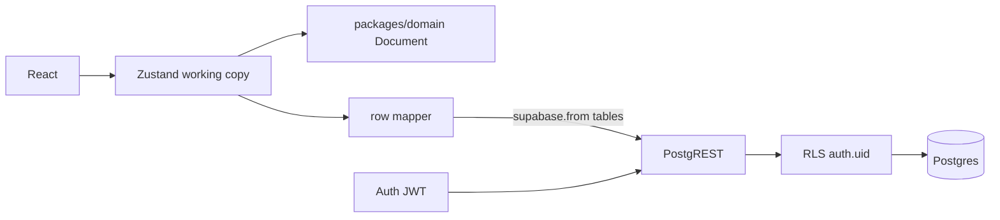
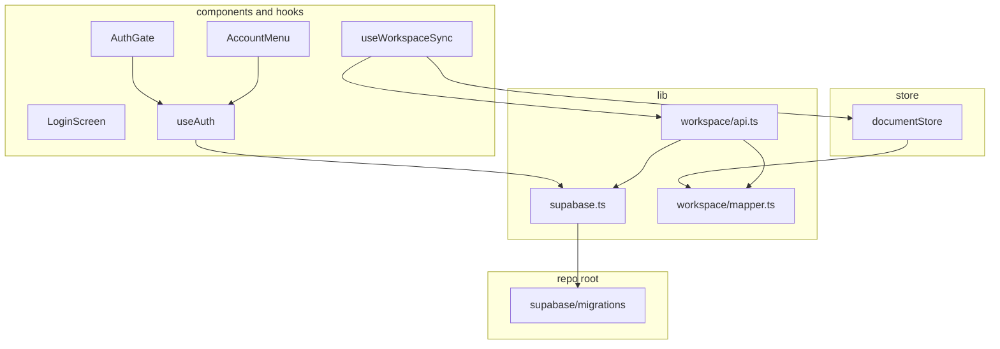
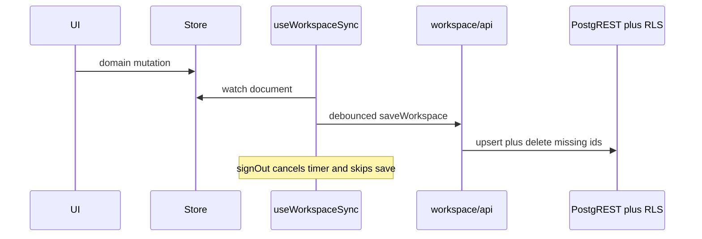
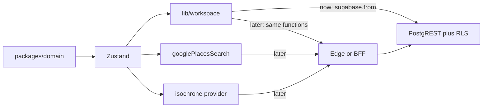

# Server-backed persist (Supabase, relational)

**Last updated:** 2026-08-13. Schema, auth UI, and IndexedDB replacement are in. Remaining: README / static-deploy / API-key referrer notes (`env-docs-deploy`). Architecture persist sections were updated with `replace-idb`.

### `replace-idb` landed

- [`lib/workspace/`](apps/web/src/lib/workspace/) — pure `mapper.ts` (`rowsToDocument` / `documentToRows` / `wouldWipeNonEmptyWorkspace`) + `api.ts` (`ensureWorkspace` / `loadWorkspace` / `saveWorkspace`) + `mapper.test.ts` (round-trip, tree order, empty-wipe guard). Public seam also re-exports `EmptyWorkspaceWipeError`.
- [`useWorkspaceSync`](apps/web/src/hooks/useWorkspaceSync.ts) — hydrate on `INITIAL_SESSION` / `SIGNED_IN` / `PASSWORD_RECOVERY` (not token refresh); 800ms debounced `saveWorkspace`; skip the post-hydrate echo; on `SIGNED_OUT` cancel the timer, `resetLocal()`, **do not write**. Load is deferred with `queueMicrotask` so the auth callback does not deadlock.
- [`documentStore`](apps/web/src/store/documentStore.ts) — no Zustand persist / `idb-keyval`; `workspaceId`, `hydrateDocument`, `resetLocal`. Mutations still do not call PostgREST.
- [`App.tsx`](apps/web/src/App.tsx) — mounts `useWorkspaceSync`; authenticated chrome waits until `hydrated` (no edits against an empty tree); `Toaster` at the App root so load/save errors are visible.
- Domain `createId` prefixes are `wsp` / `lyr` / `plc` / `iso` (Postgres CHECKs). `idb-keyval` removed; `vitest` in `apps/web`.

IndexedDB is not the store. There is also **no custom backend**. The API is Supabase PostgREST over Postgres tables. The browser calls it with the signed-in user's JWT; **RLS** decides what rows exist for that request.

**Docs source of truth:** do not re-learn from model training data. Before implementing, fetch [changelog.md](https://supabase.com/changelog.md) (scan `breaking-change`), look up topics via MCP `search_docs` or docs `.md` URLs, and apply the local Supabase + Postgres best-practices skills. Pin Supabase package versions (no floating `^`).



## What “document” means

Two different things; do not mix them:

- **Domain `Document`** ([`packages/domain`](packages/domain) `types.ts`) — the in-memory tree the UI already uses: `rootChildren`, `nodes`, `defaultPlaceColor`. Zustand holds this working copy. It is not stored as one JSON value.
- **SQL `workspaces`** — one **header row per user** (`user_id`, `default_place_color`, `updated_at`). Layers, places, isochrones, and `tree_nodes` hang off `workspace_id`. This is not a document blob.

The old Architecture name “document” meant the whole map project (Figma-style). In Postgres that project is a **workspace**.

## Why Zustand still exists (`documentStore`)

[`apps/web/src/store/documentStore.ts`](apps/web/src/store/documentStore.ts) is not a database. It is the **client working copy**:

- domain `Document` (`nodes`, `rootChildren`) so `flattenTree`, `resolveDropTarget`, and mutations stay pure and unit-tested
- UI ephemera: selection, search preview, toasts

Drop Zustand **persist / idb-keyval**. After each domain mutation, debounce a sync to Postgres. Load on sign-in. Logout clears local state and **does not write**.

No `authStore`. Session lives in supabase-js (`useAuth`). Gate the app with **`getClaims()`** (JWKS; default for new projects) — not `getSession().user`. Use `getUser()` only when you need a fresh Auth user row; `getSession()` is raw tokens only. The filename stays `documentStore` because the domain type is still `Document`; we are not wrapping a JSON blob anymore.

## Transform: DB rows ↔ domain (not `documentDb`)

No generic “document database” module. A **`lib/workspace/`** cluster next to the Supabase client (same pattern as [`lib/isochrone/`](apps/web/src/lib/isochrone/)): pure mapper in `mapper.ts`, PostgREST in `api.ts`. Public seam is [`lib/workspace/index.ts`](apps/web/src/lib/workspace/index.ts) (`loadWorkspace` / `saveWorkspace` / `ensureWorkspace`).

**Load (PostgREST → domain)**

1. `workspaces` row for the signed-in user (`ensureWorkspace` upsert-on-conflict)
2. `select` `layers`, `places`, `isochrones`, `tree_nodes` where `workspace_id = …`
3. `rowsToDocument`:
    - each layer/place/isochrone row → `DocNode` (`lng`/`lat` → `coordinates`, `source_provider`/`provider_id` → `sourceProvider`/`providerId`, `origin_place_id` → `originPlaceId`)
    - `tree_nodes` ordered by `parent_id`, `sort_index` → `rootChildren` and each layer’s `children`

**Save (domain → PostgREST)**

1. `documentToRows` splits `Document` into layer / place / isochrone / `tree_nodes` rows
2. Upsert those rows keyed by `id`
3. Delete DB rows whose ids are no longer in the tree
4. Abort if that delete set would wipe a non-empty workspace (empty-client guard)

Isochrone `geojson` / `contours` stay JSONB **columns** on the isochrone row.

The UI never thinks in SQL. Domain never imports `supabase-js`. Only `lib/workspace/` (mapper + api) and `useWorkspaceSync` know about tables.

## Secure access from the client

This app is a **static Vite SPA** (no cookie session, no server loaders). Use **`@supabase/supabase-js` only** — do **not** add `@supabase/ssr` or a `lib/supabase/server.ts`. Official React/Vite quickstart:

```ts
import { createClient } from '@supabase/supabase-js';

export const supabase = createClient<Database>(
    import.meta.env.VITE_SUPABASE_URL,
    import.meta.env.VITE_SUPABASE_PUBLISHABLE_KEY,
);
```

Env:

- `VITE_SUPABASE_URL`
- `VITE_SUPABASE_PUBLISHABLE_KEY` — value is `sb_publishable_...` (legacy `anon` JWT still works until disabled end of 2026; prefer publishable). **This key is public.** Anyone can extract it from the bundle. That is expected.

Publishable key with **no session** → Postgres role `anon`. With a signed-in user JWT → role `authenticated`. Same security model as the old anon key, new key type.

**Pin** `@supabase/supabase-js` to an exact version in `package.json` (skill: no floating `^` on supabase packages) and commit the lockfile. Drop any `@supabase/ssr` dependency if present from scaffolding.

What actually protects data:

1. **Sign-in** (magic link via `signInWithOtp({ email, options: { emailRedirectTo } })`) issues a user JWT. `supabase-js` sends `Authorization: Bearer <jwt>` on every table request.
2. **RLS** on every table: policies use `TO authenticated` plus ownership `(select auth.uid()) = user_id` (or `EXISTS` on the owning workspace). Never `auth.role() = 'authenticated'` (deprecated; breaks with anonymous sign-ins). Wrap `auth.uid()` in `(select …)` for initPlan caching. Anon with no session gets zero rows. User A cannot `select`/`update`/`delete` user B’s layers.
3. **Explicit `GRANT`s are required** (Apr 2026 Data API breaking change — new `public` tables are not auto-exposed): `GRANT` CRUD to `authenticated` only; **no useful grants to `anon`**. Missing grant → PostgREST `42501`, not a silent RLS empty set. Treat GRANT + `ENABLE ROW LEVEL SECURITY` + policies as one migration unit.
4. **Never** put `service_role` / secret keys in the web app. That key bypasses RLS.
5. UPDATE needs a matching SELECT policy, and UPDATE policies need both `USING` and `WITH CHECK` so a user cannot reassign `user_id` / `workspace_id`.

So “securely accessing Supabase from the client” means: **public publishable key + user JWT + explicit GRANTs + RLS**, not a hidden server connection string.

Mapbox/Google keys stay `VITE_*` for this slice (restrict by HTTP referrer). They are unrelated to Postgres.

### Auth session APIs + magic link (SPA)

- **`getClaims()`** — verify identity / gate `AuthGate` (JWKS). Do not trust `getSession().user` for authorization.
- **`getUser()`** — network round-trip when you need a fresh Auth user row.
- **`getSession()`** — raw tokens only.
- **`onAuthStateChange`** — subscription for sign-in/out.

PKCE: `auth.flowType: 'pkce'` and `detectSessionInUrl: true` (supabase-js defaults already do this for browser SPAs). Configure **Site URL** + **Redirect URLs** (`http://localhost:5173`, production origin) in the dashboard / `supabase/config.toml`. Pass `emailRedirectTo` from `signInWithOtp`.

Do **not** copy the Next.js / passwordless-docs `token_hash` email template (`/auth/confirm?token_hash=...`) — that is for **server** confirm routes. Leave the default Magic Link template (`{{ .ConfirmationURL }}`). Auth verifies, then redirects to Site URL with `?code=`; the client exchanges it.

## Schema (one workspace per user)

Create migrations with **`supabase migration new <name>`** — never invent `<timestamp>_init.sql` filenames by hand.

`workspaces`: `id`, `user_id` unique → `auth.users(id)` **ON DELETE CASCADE** (PK only — do not rely on other `auth` unique indexes), `default_place_color`, `updated_at`

- `layers`: `id`, `workspace_id`, `name`, `visible`, `color`, `maki`, `collapsed`
- `places`: `id`, `workspace_id`, `name`, `source_provider` (`google`|`mapbox`), `provider_id`, `lng`, `lat`, `address`, `feature_type`, `maki`, `visible` — unique `(workspace_id, source_provider, provider_id)`
- `isochrones`: `id`, `workspace_id`, `name`, `center_lng`, `center_lat`, `profile`, `metric`, `contours` jsonb, `geojson` jsonb, `color`, `visible`, `origin_place_id` nullable FK → `places(id)` on delete cascade
- `tree_nodes`: composite PK `(workspace_id, node_id)`, `kind`, `parent_id` nullable, `sort_index` — mixed sibling order

**Indexes (required):** Postgres does not auto-index FKs. Index `workspaces.user_id`, every `workspace_id` column, and `isochrones.origin_place_id`.

JSONB `contours` / `geojson`: store/load whole documents; no GIN unless we query inside JSON.

`tree_nodes.node_id` is polymorphic (`kind` says layer / place / isochrone). `parent_id` is null at root, otherwise a layer id.

```mermaid
erDiagram
  auth_users ||--|| workspaces : owns
  workspaces ||--o{ layers : contains
  workspaces ||--o{ places : contains
  workspaces ||--o{ isochrones : contains
  workspaces ||--o{ tree_nodes : orders
  layers ||--o{ tree_nodes : "parent_when_nested"
  places ||--o{ isochrones : "originPlace"

  auth_users {
    uuid id PK
    string email
  }

  workspaces {
    text id PK
    uuid user_id UK_FK
    string default_place_color
    timestamptz updated_at
  }

  layers {
    text id PK
    text workspace_id FK
    string name
    boolean visible
    string color
    string maki
    boolean collapsed
  }

  places {
    text id PK
    text workspace_id FK
    string name
    string source_provider
    string provider_id
    float lng
    float lat
    string address
    string feature_type
    string maki
    boolean visible
  }

  isochrones {
    text id PK
    text workspace_id FK
    text origin_place_id FK
    string name
    float center_lng
    float center_lat
    string profile
    string metric
    jsonb contours
    jsonb geojson
    string color
    boolean visible
  }

  tree_nodes {
    text workspace_id FK
    text node_id
    string kind
    text parent_id
    int sort_index
  }
```

First login: `ensureWorkspace` inserts an empty `workspaces` row (no tree rows) via unique `user_id` + `INSERT … ON CONFLICT (user_id) DO NOTHING` (avoid SELECT-then-INSERT race). Prefer client `ensureWorkspace` over a `SECURITY DEFINER` helper in `public`. If a trigger is added later: private schema, `set search_path = ''`, `auth.uid()` in the body, revoke `EXECUTE` from `anon`/`authenticated`.

### RLS policy shape (required)

`workspaces` (example SELECT/ALL pattern):

```sql
to authenticated
using ( (select auth.uid()) = user_id )
with check ( (select auth.uid()) = user_id )  -- INSERT/UPDATE
```

Child tables (`layers`, `places`, `isochrones`, `tree_nodes`): `EXISTS` on `workspaces` where `user_id = (select auth.uid())` — same `(select …)` wrap; UPDATE/INSERT policies include matching `WITH CHECK`.

After schema: run `supabase db advisors` (or MCP `get_advisors`).

## IDs

The **client** generates ids in [`createId`](packages/domain/src/document.ts): `` `${prefix}_${crypto.randomUUID()}` ``. Postgres does not assign them; it CHECKs the prefix. The mapper never mints a second id. (`auth.users.id` is still created by Supabase Auth.) Client `prefix_${uuid v4}` text PKs are a product choice for domain `createId`; random UUIDs fragment indexes — acceptable at this app’s scale, not the skill’s default (`identity` / UUIDv7).

- `wsp_` — workspaces (once, on first login, before insert)
- `lyr_` — layers (on create)
- `plc_` — places (on add)
- `iso_` — isochrones (on add)

`tree_nodes` has no id: `node_id` is the child’s id; `parent_id` is null or a `lyr_` id. `origin_place_id` is the place’s `plc_` id.

## App file layout

Domain still never imports `supabase-js`. UI still never calls `supabase.from`.



### New files (`apps/web`)

```
apps/web/src/
  lib/
    supabase.ts                         # browser singleton (publishable key, PKCE defaults)
    database.types.ts                   # generated PostgREST types
    workspace/
      types.ts                          # row DTOs used by mapper (thin wrappers over generated)
      mapper.ts                         # rowsToDocument / documentToRows (pure)
      mapper.test.ts                    # round-trip + tree_nodes order
      api.ts                            # loadWorkspace / saveWorkspace / ensureWorkspace
      index.ts                          # re-export load/save/ensure + EmptyWorkspaceWipeError
  hooks/
    useAuth.ts                          # getClaims gate, magic-link, signOut, onAuthStateChange
    useWorkspaceSync.ts                 # hydrate on sign-in; debounce save; skip on logout
  components/
    auth/
      AuthGate.tsx                      # no claims → LoginScreen; loading → existing spinner
      LoginScreen.tsx                   # email + magic link
      AccountMenu.tsx                   # sidebar email + logout
```

- [`lib/supabase.ts`](apps/web/src/lib/supabase.ts) — browser singleton via `createClient<Database>(VITE_SUPABASE_URL, VITE_SUPABASE_PUBLISHABLE_KEY)` from `@supabase/supabase-js` (not `@supabase/ssr`). PKCE + `detectSessionInUrl` are browser defaults; set explicitly if needed. Session JWT stays in supabase-js storage (not Zustand). Never `service_role`. No `lib/supabase/server.ts`.
- [`lib/database.types.ts`](apps/web/src/lib/database.types.ts) — output of `supabase gen types --lang typescript --local > apps/web/src/lib/database.types.ts` (or remote equivalent). Commit it. Pass `createClient<Database>(…)`. Mapper/api import `Tables<'layers'>` etc. from here.
- [`lib/workspace/types.ts`](apps/web/src/lib/workspace/types.ts) — `WorkspaceSnapshot` (`workspace` + `layers` + `places` + `isochrones` + `tree_nodes`). Optional camelCase aliases if generated names are too noisy.
- [`lib/workspace/mapper.ts`](apps/web/src/lib/workspace/mapper.ts) — `rowsToDocument(snapshot) → Document`; `documentToRows(doc, workspaceId) → snapshot`. Column map: `lng`/`lat` ↔ `coordinates`; `source_provider`/`provider_id` ↔ `sourceProvider`/`providerId`; `origin_place_id` ↔ `originPlaceId`. `tree_nodes` ordered by `parent_id`, `sort_index` → `rootChildren` / layer `children`. Does **not** mint ids. Does **not** import `supabase-js`.
- [`lib/workspace/api.ts`](apps/web/src/lib/workspace/api.ts) — `ensureWorkspace()` — `INSERT … ON CONFLICT (user_id) DO NOTHING` then select by `(select auth.uid())` equivalent on the client (`user.id` from claims/session); mint `{ id: createId('wsp'), user_id }` with empty tree. `loadWorkspace()` — fetch four child tables, `rowsToDocument`. `saveWorkspace(doc, workspaceId)` — `documentToRows`, **batch** upserts by `id` (not per-row round trips), delete missing ids, **abort if delete set would wipe a non-empty workspace**. Update `workspaces.updated_at`.
- [`lib/workspace/index.ts`](apps/web/src/lib/workspace/index.ts) — public seam: `loadWorkspace`, `saveWorkspace`, `ensureWorkspace`. Store/hooks import this, not table names.
- [`hooks/useAuth.ts`](apps/web/src/hooks/useAuth.ts) — `claims` / loading from `getClaims()`; `signInWithOtp({ email, options: { emailRedirectTo } })`; `signOut()`; subscribe `onAuthStateChange`. Do not authorize from `getSession().user`.
- [`hooks/useWorkspaceSync.ts`](apps/web/src/hooks/useWorkspaceSync.ts) — on `INITIAL_SESSION` / `SIGNED_IN` / `PASSWORD_RECOVERY`: `loadWorkspace` → `hydrateDocument`. Subscribe to `document` (not UI ephemera); debounce flush → `saveWorkspace`. On `SIGNED_OUT`: cancel timer, `resetLocal()`, **do not write**.
- [`components/auth/AuthGate.tsx`](apps/web/src/components/auth/AuthGate.tsx) — gate on `getClaims`, around today’s chrome: unauthenticated users never see map/store data.
- [`components/auth/LoginScreen.tsx`](apps/web/src/components/auth/LoginScreen.tsx) — magic-link form (existing shadcn `Input` / `Button`); default ConfirmationURL template (no `token_hash` server confirm route).
- [`components/auth/AccountMenu.tsx`](apps/web/src/components/auth/AccountMenu.tsx) — compact email + Log out for the sidebar footer.

### New files (repo root — not a package)

```
supabase/
  config.toml                           # Site URL + Redirect URLs for SPA PKCE
  migrations/
    <cli-generated>_….sql               # from `supabase migration new <name>` only
```

Create the init migration with **`supabase migration new init_workspace`** (or similar) — never hand-invent timestamps. One migration is enough for v1: tables, CHECKs, FKs, **FK indexes**, composite PK on `tree_nodes`, **explicit `GRANT`s** to `authenticated`, `ENABLE ROW LEVEL SECURITY`, policies `TO authenticated` with `(select auth.uid())` ownership / `EXISTS` + UPDATE `WITH CHECK`. No useful grants to `anon`.

`.gitignore`: add `.supabase/` (CLI temp). Do not commit secrets.

### Touched existing files (no new modules)

- [`apps/web/src/store/documentStore.ts`](apps/web/src/store/documentStore.ts) — drop `persist`, `idb-keyval`, IDB empty-guard, IndexedDB migrate v2–v4. Keep `document` + UI ephemera. Add `workspaceId: string | null`, `hydrateDocument({ document, workspaceId })`, `resetLocal()` (empty doc, clear selection/preview, `hydrated: false`). Mutations stay domain wrappers; they do **not** call PostgREST (`useWorkspaceSync` watches `document`).
- [`apps/web/src/App.tsx`](apps/web/src/App.tsx) — wrap with `AuthGate`; mount `useWorkspaceSync`; drop `useDocumentStore.persist.onFinishHydration`; wait on `hydrated` before showing map chrome.
- [`apps/web/src/components/AppSidebar.tsx`](apps/web/src/components/AppSidebar.tsx) — render `AccountMenu` at the bottom of the floating sidebar (search / layers unchanged).
- [`apps/web/src/vite-env.d.ts`](apps/web/src/vite-env.d.ts) + [`apps/web/.env.example`](apps/web/.env.example) — `VITE_SUPABASE_URL`, `VITE_SUPABASE_PUBLISHABLE_KEY`.
- [`apps/web/package.json`](apps/web/package.json) — add **pinned** `@supabase/supabase-js` (exact version, no `^`); remove `idb-keyval` and any `@supabase/ssr`; add `vitest` for mapper tests (domain already has it).
- [`packages/domain/src/document.ts`](packages/domain/src/document.ts) — `createId(prefix: 'wsp' | 'lyr' | 'plc' | 'iso')`.
- [`packages/domain/src/mutations.ts`](packages/domain/src/mutations.ts) — `createId('lyr'|'plc'|'iso')`. Workspace id is minted only in `ensureWorkspace`.
- [`packages/domain/src/index.ts`](packages/domain/src/index.ts) + [`domain.test.ts`](packages/domain/src/domain.test.ts) — export prefix type; assert prefixes.
- [`docs/ARCHITECTURE.md`](docs/ARCHITECTURE.md) + [`README.md`](README.md) — Zustand = working copy; mapper = I/O seam; IndexedDB gone; env names only (`VITE_SUPABASE_PUBLISHABLE_KEY`).

If scaffolding left `apps/web/src/lib/supabase/client.ts` + `server.ts` from the SSR template, replace with the single browser `lib/supabase.ts` and delete the SSR split.

Leave IndexedDB migrate helpers in domain (`migratePlaceVisibility`, etc.) unused by the store; Postgres is a fresh schema, not a blob migrate.

### What does not get a file

- No `packages/api`, Edge Functions, or `documentDb.ts`.
- No `supabase.from(...)` in components or domain.
- No Zustand persist middleware and no IDB key `map-layers:v1`.
- Auth JWT is not a second document blob — supabase-js owns the session.

### Sync data flow



## Deploy

Static Vite build (Vercel or Cloudflare Pages) with the four `VITE_*` vars. Restrict Google Places + Mapbox tokens to production (and local).

## Architecture

Update [`docs/ARCHITECTURE.md`](docs/ARCHITECTURE.md): Zustand is the working copy; Postgres is source of truth; mapper is the I/O boundary (so a later BFF is an adapter swap); publishable key + JWT + explicit GRANTs + RLS; IndexedDB removed; import/export, realtime, multi-document deferred.

## When a backend is actually needed

Not for “Postgres + login + my layers.” Supabase already is that server (Auth + PostgREST + RLS). A static SPA is enough for this plan.

Add **Edge Functions or a small API** when the browser is the wrong place to run the work:

- **Secrets** — Mapbox/Google keys in `VITE_*` are visible. Referrer restriction is a speed bump. Hide them when you care about quota theft: proxy Places + Isochrone server-side.
- **Rules RLS cannot express cleanly** — sharing a tree, invite links, “editor vs viewer,” billing, rate limits on expensive APIs.
- **Privileged writes** — anything that must use `service_role` (never in the client). That belongs in a function you control.
- **Multi-step transactions** beyond “upsert these rows” — a Postgres `SECURITY INVOKER` RPC can still avoid a Node server; a BFF is for logic that is not SQL.

Until then: no Express/Lambda app. Postgres RPC or one Edge Function is the next step, not a general backend.

## Path to a backend later

Yes, if we keep one seam: **UI and `packages/domain` never call PostgREST**. Only `lib/workspace/` (`loadWorkspace` / `saveWorkspace`) and today’s search/isochrone `lib/` adapters talk to the network.

That is the same layering Architecture already has (`lib/` = I/O adapters). Adding a backend is swapping adapters, not rewriting the tree or the sidebar.



Concrete order when it becomes necessary:

1. **Edge Functions for secrets** — Places + Isochrone use a server Mapbox/Google key. Client `lib/` functions change URL from Google/Mapbox to `/functions/v1/...`. Schema and mapper unchanged.
2. **Postgres RPC** — still no Node app. Use for transactions or sharing rules that are SQL.
3. **BFF** — `lib/workspace` `loadWorkspace` / `saveWorkspace` call _your_ HTTP API with the user JWT; the server uses `service_role` or the user JWT against Postgres. Tables and RLS stay. Zustand and domain stay.

What would block this path: sprinkling `supabase.from('places')` through components, or moving domain mutations into SQL-only with no in-memory `Document`. We will not do that in this plan.

## Out of scope (this plan)

- A custom API/BFF in front of Supabase
- Per-keystroke SQL (still debounce a tree flush)
- Realtime / multi-tab merge
- Sharing a tree between users
- Proxying Mapbox/Google through Edge Functions
