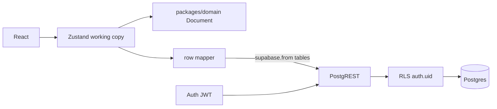
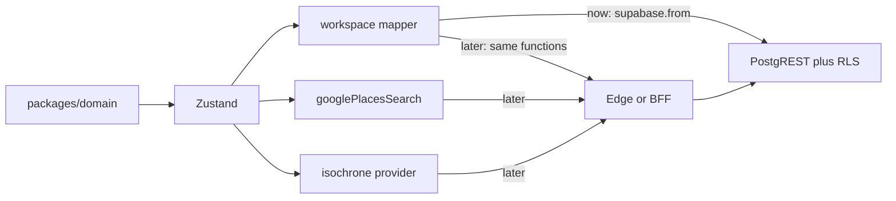

# Server-backed persist (Supabase, relational)

IndexedDB is not the store. There is also **no custom backend**. The API is Supabase PostgREST over Postgres tables. The browser calls it with the signed-in user's JWT; **RLS** decides what rows exist for that request.

## Why Zustand still exists (`documentStore`)

[`apps/web/src/store/documentStore.ts`](apps/web/src/store/documentStore.ts) is not a database. It is the **client working copy**:

- domain `Document` (`nodes`, `rootChildren`) so `flattenTree`, `resolveDropTarget`, and mutations stay pure and unit-tested
- UI ephemera: selection, search preview, toasts

Drop Zustand **persist / idb-keyval**. After each domain mutation, debounce a sync to Postgres. Load on sign-in. Logout clears local state and **does not write**.

Auth session can live in the same store or a tiny `auth` slice. The filename can stay `documentStore` because the domain type is still `Document`; we are not wrapping a JSON blob anymore.

## Transform: DB rows ↔ domain (not `documentDb`)

No generic “document database” module. A **mapper** next to the Supabase client, e.g. [`apps/web/src/lib/workspaceMapper.ts`](apps/web/src/lib/workspaceMapper.ts):

**Load (PostgREST → domain)**

1. `documents` row for `auth.uid()` (create empty workspace if none)
2. `select` `layers`, `places`, `isochrones`, `tree_nodes` where `document_id = …`
3. `rowsToDocument`:
   - each layer/place/isochrone row → `DocNode` (`lng`/`lat` → `coordinates`, `mapbox_id` → `mapboxId`, `origin_place_id` → `originPlaceId`)
   - `tree_nodes` ordered by `parent_id`, `sort_index` → `rootChildren` and each layer’s `children`

**Save (domain → PostgREST)**

1. `documentToRows` splits `Document` into layer / place / isochrone / `tree_nodes` rows
2. Upsert those rows keyed by `id`
3. Delete DB rows whose ids are no longer in the tree
4. Abort if that delete set would wipe a non-empty workspace (empty-client guard)

Isochrone `geojson` / `contours` stay JSONB **columns** on the isochrone row.

The UI never thinks in SQL. Domain never imports `supabase-js`. Only the mapper + store sync know about tables.

## Secure access from the client

The Vite app uses `@supabase/supabase-js` with:

- `VITE_SUPABASE_URL`
- `VITE_SUPABASE_ANON_KEY` (publishable) — **this key is public**. Anyone can extract it from the bundle. That is expected.

What actually protects data:

1. **Sign-in** (magic link) issues a user JWT. `supabase-js` sends `Authorization: Bearer <jwt>` on every table request.
2. **RLS** on every table: a row is visible/writable only if it belongs to a `documents` row where `user_id = auth.uid()`. Anon with no session gets zero rows. User A cannot `select`/`update`/`delete` user B’s layers.
3. **Grants**: `anon` has no useful table rights (or only `insert` into nothing that RLS allows). `authenticated` has CRUD **subject to RLS**.
4. **Never** put `service_role` in the web app. That key bypasses RLS.
5. UPDATE policies require a matching SELECT policy (Postgres RLS).

So “securely accessing Supabase from the client” means: **public anon key + user JWT + RLS**, not a hidden server connection string.

Mapbox/Google keys stay `VITE_*` for this slice (restrict by HTTP referrer). They are unrelated to Postgres.

## Schema (one workspace per user)

`documents`: `id`, `user_id` unique → `auth.users`, `default_place_color`, `updated_at`

- `layers`: `id`, `document_id`, `name`, `visible`, `color`, `maki`, `collapsed`
- `places`: `id`, `document_id`, `name`, `mapbox_id`, `lng`, `lat`, `address`, `feature_type`, `maki`, `raw` jsonb, `visible`
- `isochrones`: `id`, `document_id`, `name`, `center_lng`, `center_lat`, `profile`, `metric`, `contours` jsonb, `geojson` jsonb, `color`, `visible`, `origin_place_id` nullable FK → `places(id)` on delete cascade
- `tree_nodes`: `document_id`, `node_id`, `kind`, `parent_id` nullable, `sort_index` — mixed sibling order

First login: insert an empty `documents` row (no tree rows).

## App changes

- [`apps/web/src/lib/supabase.ts`](apps/web/src/lib/supabase.ts) — browser client, PKCE, session
- [`apps/web/src/lib/workspaceMapper.ts`](apps/web/src/lib/workspaceMapper.ts) — row ↔ `Document` + `loadWorkspace` / `saveWorkspace`
- [`apps/web/src/store/documentStore.ts`](apps/web/src/store/documentStore.ts) — remove persist; hydrate/sync via mapper
- Login gate + sidebar logout
- `supabase/migrations/` via `supabase migration new`

## Deploy

Static Vite build (Vercel or Cloudflare Pages) with the four `VITE_*` vars. Restrict Google Places + Mapbox tokens to production (and local).

## Architecture

Update [`docs/ARCHITECTURE.md`](docs/ARCHITECTURE.md): Zustand is the working copy; Postgres is source of truth; mapper is the I/O boundary (so a later BFF is an adapter swap); RLS + JWT; IndexedDB removed; import/export, realtime, multi-document deferred.

## When a backend is actually needed

Not for “Postgres + login + my layers.” Supabase already is that server (Auth + PostgREST + RLS). A static SPA is enough for this plan.

Add **Edge Functions or a small API** when the browser is the wrong place to run the work:

- **Secrets** — Mapbox/Google keys in `VITE_*` are visible. Referrer restriction is a speed bump. Hide them when you care about quota theft: proxy Places + Isochrone server-side.
- **Rules RLS cannot express cleanly** — sharing a tree, invite links, “editor vs viewer,” billing, rate limits on expensive APIs.
- **Privileged writes** — anything that must use `service_role` (never in the client). That belongs in a function you control.
- **Multi-step transactions** beyond “upsert these rows” — a Postgres `SECURITY INVOKER` RPC can still avoid a Node server; a BFF is for logic that is not SQL.

Until then: no Express/Lambda app. Postgres RPC or one Edge Function is the next step, not a general backend.

## Path to a backend later

Yes, if we keep one seam: **UI and `packages/domain` never call PostgREST**. Only the mapper (load/save workspace) and today’s search/isochrone `lib/` adapters talk to the network.

That is the same layering Architecture already has (`lib/` = I/O adapters). Adding a backend is swapping adapters, not rewriting the tree or the sidebar.

Concrete order when it becomes necessary:

1. **Edge Functions for secrets** — Places + Isochrone use a server Mapbox/Google key. Client `lib/` functions change URL from Google/Mapbox to `/functions/v1/...`. Schema and mapper unchanged.
2. **Postgres RPC** — still no Node app. Use for transactions or sharing rules that are SQL.
3. **BFF** — mapper’s `loadWorkspace` / `saveWorkspace` call *your* HTTP API with the user JWT; the server uses `service_role` or the user JWT against Postgres. Tables and RLS stay. Zustand and domain stay.

What would block this path: sprinkling `supabase.from('places')` through components, or moving domain mutations into SQL-only with no in-memory `Document`. We will not do that in this plan.

## Out of scope (this plan)

- A custom API/BFF in front of Supabase
- Per-keystroke SQL (still debounce a tree flush)
- Realtime / multi-tab merge
- Sharing a tree between users
- Proxying Mapbox/Google through Edge Functions
