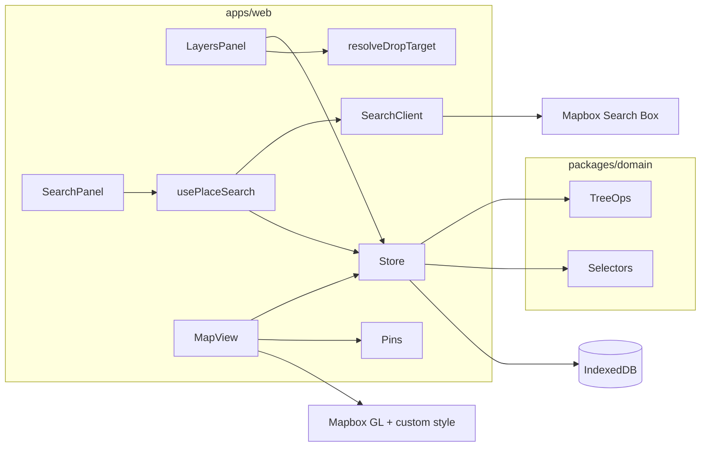

# Map Layers — System, Architecture & UI Design

## Status

- Last updated: 2026-08-06
- Implemented: living docs; monorepo; domain (+ `resolveDropTarget`); Zustand/IndexedDB; Mapbox (LA default + geolocation); layers panel (color + **optional Maki icon**; Heroicons for drag / chevron expand / eye visibility); pins with Maki glyphs (place `maki`, overridable by nearest ancestor layer `maki`); Search Box with on-map preview pins (random color reused for new layers); fit bounds; modals/toasts; UI orchestration hooks (`usePlaceSearch`, `useFlyToSelectedPlace`, `useFlyToUserOnce`) + shared `mapCamera` helpers; **shadcn/ui (base-rhea / taupe, always light)** for chrome + controls
- In progress: none
- Next: optional polish (layer opacity, clustering, isochrones)
- Deferred: see [Explicitly deferred](#explicitly-deferred) and [Future: isochrone / isodistance](#future-isochrone--isodistance-architecture-fit)

---

## Product summary

A solo, local-first web app: full-bleed Mapbox map + left layers panel. Users search for places, add one/many/all results into nested layers (or the top of the tree), then show/hide layers and assign a layer color that drives all pins under that layer.

**Out of scope (v1):** accounts, sync, import/export, multiplayer.

---

## Stack (locked)

| Layer | Choice |
| --- | --- |
| Monorepo | **pnpm workspaces + Turborepo** |
| App | React 19 + Vite + TypeScript |
| CSS | Tailwind CSS v4 (`@tailwindcss/vite`) |
| UI | **shadcn/ui** (CLI v4, style **base-rhea**, base color **taupe**, always light `:root` tokens); primitives under `apps/web/src/components/ui` |
| Lint/format | Biome (root config) |
| Map | `mapbox-gl` + `react-map-gl` |
| Map style | `mapbox://styles/louiscohen/cm54miu4700j201qparty6veb` (from yelp-combinator) |
| Token | `VITE_MAPBOX_ACCESS_TOKEN` in `apps/web/.env` |
| State | Zustand + persist to **IndexedDB** (`idb-keyval`) |
| DnD | `@dnd-kit` for layer tree reorder/reparent |
| Motion | `motion` (pin select / panel transitions) |
| Toasts | **sonner** (via shadcn `Toaster`; `pushToast` in the store) |
| Pin glyphs | `@mapbox/maki` (from Search Box `maki`) |
| Search | **Mapbox Search Box API** (see note below) |

### Search API note (important)

Mapbox Geocoding was the original ask. **Geocoding v6 no longer returns POIs** (restaurants, shops, etc.) — only addresses/places in the administrative sense. For a “places” product, v1 will use **[Search Box API](https://docs.mapbox.com/api/search/search-box/)** (`/search/searchbox/v1/...`) with:

- debounce + `proximity` / `bbox` from current map viewport
- session tokens for Suggest → Retrieve
- permanent storage eligibility respected for saved places (Mapbox terms: do not persist temporary geocode-only results without the permanent/storage-allowed path)

If pure address geocoding is needed later, add Geocoding v6 as a second mode behind the same `PlaceSearchProvider` interface.

---

## Monorepo layout

```
map-layers/
  apps/web/                 # Vite React app (the product)
  packages/
    domain/                 # pure TS: tree model, selectors, mutations (no React)
    tsconfig/               # shared TS configs
  docs/
    ARCHITECTURE.md         # this file — primary living app doc
  AGENTS.md
  .cursor/rules/
    architecture-doc.mdc
  biome.json
  package.json
  pnpm-workspace.yaml
  turbo.json
```

- **`packages/domain`**: tree operations, effective visibility/color, DnD drop resolution, IDs — unit-testable without the UI.
- **`apps/web`**: Mapbox UI, Zustand store wiring, search client, pin components adapted from yelp-combinator.

### App layering (`apps/web`)

| Layer | Responsibility |
| --- | --- |
| `packages/domain` | Pure document/tree rules (mutations, selectors, `resolveDropTarget`) |
| `lib/` | I/O adapters (`mapboxSearch`) and Mapbox camera helpers (`mapCamera`) |
| `store/` | Zustand: document + selection + `searchPreview`; wraps domain; toasts via sonner |
| `hooks/` | React lifecycle + store coordination (`usePlaceSearch`, `useLocation`, camera policies) |
| `components/` | Presentational UI: props/events in, render out (`components/ui` = shadcn primitives) |

No backend package in v1.

---

## Domain model

Flat node map + ordered child ID lists (same pattern as Figma: easy move/reparent without deep immutable clones).

**Discriminated union from day one** so future geometry types (isochrones, etc.) slot in without rewriting the tree:

```ts
type NodeId = string;

type PlaceNode = {
  id: NodeId;
  kind: 'place';
  name: string;
  mapboxId: string; // Search Box feature id
  coordinates: { lng: number; lat: number };
  address?: string;
  featureType?: string; // e.g. poi, address
  maki?: string; // Search Box Maki icon name (e.g. restaurant, cafe)
  raw?: unknown; // trimmed Search Box payload if useful later
};

type LayerNode = {
  id: NodeId;
  kind: 'layer';
  name: string;
  visible: boolean; // own toggle (effective = AND ancestors)
  color: string; // hex; drives pins / future fills under this layer
  maki?: string; // optional Maki icon; when set, overrides place pin glyphs under this layer
  collapsed: boolean; // UI-only, persisted for comfort
  children: NodeId[]; // ordered: layers and/or leaf content nodes
};

/** v1: only PlaceNode is implemented. Future leaf kinds share this slot. */
type ContentNode = PlaceNode; // later: PlaceNode | IsochroneNode | ...

type Document = {
  rootChildren: NodeId[];
  nodes: Record<NodeId, LayerNode | ContentNode>;
  defaultPlaceColor: string; // for places sitting at root
};
```

### Effective properties (derived)

- **Visible:** node is shown iff every ancestor layer has `visible: true` (and for a leaf, its containing path is visible). Hidden parent ⇒ all descendants hidden on the map (Figma/Photoshop behavior).
- **Color:** walk from leaf → parent layers; use the **nearest ancestor layer’s `color`**. Root-level places use `defaultPlaceColor`.
- **Maki icon:** walk from leaf → parent layers; use the **nearest ancestor layer with `maki` set**. If none, use the place’s Search Box `maki` (UI falls back to `marker`). Nested layer icon overrides parent for its subtree only.
- Nested layer with its own color overrides parent for its subtree only.
- Same cascade applies later to GeoJSON fills/outlines (isochrones inherit layer color / opacity).

### Layer naming defaults

When creating a layer from search: **default name = the search query string** (trimmed). User can rename anytime. Empty manual create: prompt for name first (modal), refuse empty.

### Core mutations (`packages/domain`)

- `createLayer({ name, parentId | root, color? })`
- `renameNode(id, name)`
- `setLayerVisible(id, visible)` / `toggleLayerVisible(id)`
- `setLayerColor(id, color)`
- `setLayerMaki(id, maki | undefined)` — optional pin glyph override for the layer’s subtree
- `moveNodes({ ids, targetParentId | root, index })` — reorder + reparent
- `resolveDropTarget(doc, activeId, overId)` — map DnD over-target to `{ parentId, index }` for `moveNodes`
- `ungroupLayer(id)` — splice layer’s `children` into parent at the layer’s index; delete the layer node
- `deleteNodes(ids)` — recursive for layers (confirm in UI); places removed from parent
- `addPlaces({ places, targetParentId | root, index? })` — dedupe by `mapboxId` within document (skip or toast duplicates)

---

## Architecture



### State (Zustand)

Single `documentStore`:

- `document: Document`
- UI: `selectedNodeIds`, `selectedPlaceId` (map focus), `searchPreview` (`color`, `results`, `selectedMapboxIds`)
- Ephemeral panel state (query string, add destination) lives in `usePlaceSearch`, not the store
- Actions wrap `packages/domain` mutations, then persist

Persist middleware → IndexedDB key `map-layers:v1`. No account.

### Map rendering (dual path by design)

Port patterns from `~/Developer/yelp-combinator-frontend` (not a hard dependency — copy/adapt):

- Map shell like `MapRender.tsx`: same style URL + token env
- Pins like `IconMarker`: 32px circle, border, shadow, selected spring scale — **`color` prop from effective layer color**
- Inner glyph = `@mapbox/maki` SVG from effective maki (`getEffectiveMaki`: nearest ancestor layer `maki`, else place `maki`, default `marker`); inlined and tinted with layer color via `currentColor`
- Optional: Supercluster + `ClusterMarker` if pin density gets high; start without clustering, add if needed
- Click pin → select place in tree + lightweight detail popover (name, address, “reveal in layers”)

Only **effectively visible** places render as markers.

**Render split (v1 implements points only; polygons reserved):**

| Content kind | Mapbox mechanism |
| --- | --- |
| `place` (points) | `react-map-gl` HTML `<Marker>` (current plan) |
| Future isochrone / isodistance (polygons) | `Source` + `Layer` (`fill` / `line`) fed by stored GeoJSON |

Layer groups stay DOM-tree UI only; they never become Mapbox style layers. Contours hang off the same tree as leaves and paint via GL sources keyed by node id.

### Search client

`apps/web/src/lib/mapboxSearch.ts`:

1. Forward (debounced) with `proximity` = map center and `bbox` = current viewport (`minLon,minLat,maxLon,maxLat`)
2. Normalize features to `PlaceDraft` (coordinates + optional `maki` in one request; no Suggest→Retrieve session needed for forward)
3. Multi-select in results UI; add selected drafts into the tree

---

## UI design

### Layout

```
┌─────────────────┬──────────────────────────────────┐
│ Layers          │                                  │
│  [+ Layer]      │           Mapbox map             │
│  tree…          │                                  │
│─────────────────│     pins colored by layer        │
│ Search places   │                                  │
│  [query     ]   │                                  │
│  results list   │                                  │
│  Add to ▾       │                                  │
└─────────────────┴──────────────────────────────────┘
```

- Left pane ~280–320px, resizable later; **light sidebar chrome** via shadcn semantic tokens (`bg-sidebar`, `border-sidebar-border`, etc.) — not dark glass, not purple/cream AI defaults.
- Map is the remaining viewport; body `overflow: hidden`, `h-svh`.
- Theme is **always light** (`:root` tokens only; no `dark` class / theme toggle in v1).
- Layer / pin colors remain **data-driven hex** (not theme tokens). User-location marker stays semantic blue.

### Layers panel (Figma-like)

Each row:

- Drag handle (`Bars2Icon`)
- Expand/collapse (`ChevronRightIcon`, CSS `rotate-90` when open; layers only)
- Visibility toggle (`EyeIcon` / `EyeSlashIcon`; layers only)
- Color swatch (layers only) → popover palette (seed from yelp `ColorPalette.ts`)
- Maki icon button (layers only) → filterable icon grid; **Auto** clears override so place icons show
- Name (inline rename on double-click / Enter)
- Context menu (`EllipsisVerticalIcon`): New sublayer, Ungroup, Delete, Fit map to contents

Behaviors:

| Action | Behavior |
| --- | --- |
| Create layer | Modal asks name → insert under selection or root |
| Reorder / nest | Drag onto layer or between rows; drop on root allowed |
| Ungroup | Children move to parent (or root); layer removed |
| Hide layer | Eye off; descendants disappear from map; nested eyes remain but ineffective until parent shown |
| Color | Sets layer color; all descendant places’ pins update immediately |

Places appear as leaf rows under their layer (indent). Selecting a place flies the map to it.

### Search → add flow

1. User types query in Search section (or Cmd-K later). Forward search uses map **center** as `proximity` and the current viewport as `bbox` (Mapbox Search Box hard-filters to that box).
2. Results list with checkboxes; “Select all”. Preview pins appear on the map; **camera stays put** (no fit/fly on results).
3. Destination control: **Top level** | **Existing layer…** | **New layer** (name prefilled with query).
4. Confirm **Add** → places inserted; if New layer, create layer then add places as children; then fly/fit bounds to the added set.

---

## Features included in v1 (explicit)

- Nested layers + root-level places
- Show/hide with ancestor cascade
- Per-layer color → pin color
- Optional per-layer Maki icon → overrides descendant pin glyphs (else place Search Box `maki`)
- Create / rename / delete / ungroup / reorder / reparent
- Search Box → add one / many / all
- Local persistence (IndexedDB)
- Place select on map ↔ tree highlight
- Fit bounds to layer or selection

## Explicitly deferred

- Import/export (GeoJSON), share links
- Accounts / sync
- Layer opacity, lock, blend modes
- Multi-document / projects
- Offline maps
- Collaboration
- Isochrone / isodistance overlays (architecture-ready; not built in v1 — see below)

---

## Future: isochrone / isodistance (architecture fit)

**Yes — this architecture supports it** without changing the layer-tree or visibility/color model. Contours are another **leaf content kind** in the same nested groups.

### How it would plug in

1. **Domain** — add a leaf node, e.g.:

```ts
type IsochroneNode = {
  id: NodeId;
  kind: 'isochrone'; // or 'isodistance'
  name: string;
  center: { lng: number; lat: number };
  profile: 'walking' | 'cycling' | 'driving';
  contours: number[]; // minutes or meters
  geojson: GeoJSON.FeatureCollection; // from Mapbox Isochrone API
};
```

Widen `ContentNode` to `PlaceNode | IsochroneNode`. Tree mutations (`move`, `delete`, visibility cascade, ungroup) already operate on `NodeId`s and do not care about geometry.

2. **API** — thin client for [Mapbox Isochrone API](https://docs.mapbox.com/api/navigation/isochrone/) (`/isochrone/v1/{profile}/{lon},{lat}`). Creation UI: pick center (map click or existing place), time vs distance, profile, contour steps → fetch GeoJSON → `addIsochrone` into target layer / new layer (name like `15 min walk`).

3. **Map** — for each effectively visible isochrone node, mount `<Source id={node.id} type="geojson" data={node.geojson}>` with fill/line layers styled from **effective layer color** (+ optional per-contour opacity). Z-order: draw polygons under HTML markers (or respect tree order via layer ordering helpers).

4. **Layers panel** — new row type (polygon icon); same eye toggle / rename / delete / drag. Color still lives on the **parent layer** (or allow a local override later). Fit-bounds uses the GeoJSON bbox.

5. **What already works unchanged:** nesting, show/hide cascade, reorder/reparent, ungroup, IndexedDB persistence, solo local-first model.

### Caveats (not blockers)

- **Two render pipelines** (HTML markers vs GL fill/line) — planned above; keep map orchestration as “collect visible leaves → dispatch by `kind`”.
- **Payload size** — Isochrone GeoJSON is larger than place points; IndexedDB is fine for moderate counts; if many contours, consider storing params + refetch, or simplifying geometry.
- **Mapbox terms** — cache/store Isochrone responses only as their ToS allows (same class of concern as Search Box persistence).
- **Opacity / blend** — useful for stacked contours; deferred with other layer chrome, but color cascade already covers the main visual link.

**v1 commitment:** do not build isochrones yet; do keep `ContentNode` as an extensible union and a single “visible leaves → render” map path so this lands as an additive feature.

---

## Implementation phases

1. **Scaffold** — pnpm + turbo + `apps/web` + `packages/domain` + Biome + Tailwind v4 + env template *(living docs already seeded)*
2. **Domain** — tree types, mutations, effective visibility/color selectors + unit tests
3. **Store + persist** — Zustand document store wired to domain
4. **Map shell** — Mapbox style/token, empty map, locate control
5. **Layers panel** — tree UI, visibility, color, create/rename/delete/ungroup, dnd
6. **Pins** — adapted IconMarker driven by effective color; selection sync
7. **Search** — Search Box client + results + add-to-target flow
8. **Polish** — fit bounds, empty states, keyboard rename, confirm dialogs
9. **Doc hygiene** — each phase ends with Architecture Status updated to match the tree

---

## Env

`apps/web/.env`:

```
VITE_MAPBOX_ACCESS_TOKEN=<token>
```

`.env.example` documents the key name only; do not commit secrets. Token names only in this doc.

---

## Living primary doc

**This file (`docs/ARCHITECTURE.md`) is the source of truth** for product intent, domain model, UI, deferred work, and how the system works today.

| File | Role |
| --- | --- |
| [`docs/ARCHITECTURE.md`](./ARCHITECTURE.md) | Canonical living design + current status |
| [`AGENTS.md`](../AGENTS.md) | Short entrypoint: read/update Architecture before/after work |
| [`.cursor/rules/architecture-doc.mdc`](../.cursor/rules/architecture-doc.mdc) | `alwaysApply: true` rule that enforces the habit |

### Agent obligations

1. **Read** this file at the start of non-trivial work.
2. **Update it in the same change** when altering behavior, domain model, stack, UI structure, or deferred/future scope.
3. Keep the top **Status** section current.
4. Prefer amending this doc over inventing parallel design docs (`README` stays install/run only).
5. If a Cursor plan under `.cursor/plans/` exists for a task, **this file wins** after divergence; sync the plan or delete it.

### What not to do

- Do not treat `.cursor/plans/` as the only design copy.
- Do not split into many overlapping markdown files without linking from here.
- Do not commit secrets into this doc (token names only).

---

## Open product defaults (chosen, not optional)

- **Delete layer:** deletes the layer and all nested places/layers (confirm dialog). Ungroup is the non-destructive alternative.
- **Duplicate mapboxId:** skip duplicate with a short toast; do not create a second pin for the same feature.
- **Default new-layer color:** next unused color from a fixed palette rotation.
- **Clustering:** off in v1; add if pin count becomes painful.
