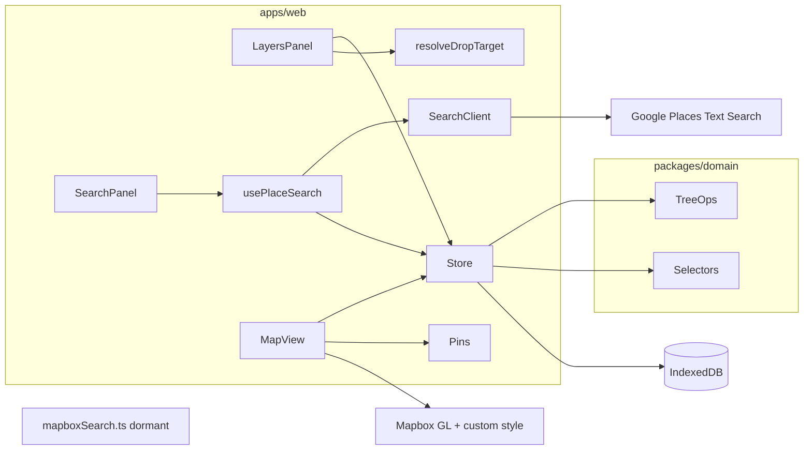

# Map Layers — System, Architecture & UI Design

## Status

- Last updated: 2026-08-12
- Implemented: living docs; monorepo; domain (+ `resolveDropTarget`); Zustand/IndexedDB; Mapbox (LA default + geolocation); layers panel (**combined color + optional Phosphor icon** via `LayerStylePicker` + **react-color** `GithubPicker`; persisted layer `maki` migrated from Maki names → Phosphor catalog); **whole-row** drag reorder; Phosphor icons for caret expand / eye visibility (**layers, places, isochrones**) / **isochrone walk·bike·drive**); **filled** pins: Phosphor catalog name on layer override; else Maki if place `maki` is a Mapbox name; else Phosphor from Google `featureType` (`MapPin` fallback); **Google Places Text Search** (Pro field mask + viewport `locationBias` + **Load more** pagination, ~60-result ceiling; pending-on-type + keep prior results until the new page; **No results** only after a settled empty response) with on-map preview pins (random color reused for new layers; **clear** control on search input); Mapbox Search Box client retained but unused; **isochrones** (time + distance; walk/bike/drive; user-chosen minutes/miles; create from search-row icon or place `…` menu; place-origin isochrones bind via `originPlaceId` — UI-nested under the place, move/delete locked, short names, **map-hidden when the origin place is hidden** without flipping the isochrone’s own `visible`; GeoJSON `Source`/`Layer`; **map-click select** via fill `queryRenderedFeatures`, overlaps pick **smallest area** and paint **largest→smallest** so small rings sit on top; provider-isolated Mapbox client with **denoise + generalize + Turf polygonSmooth**); fit bounds (places/layers only); modals/toasts; UI orchestration hooks (`usePlaceSearch`, `useIsochroneCreate`, `useFlyToUserOnce`, `useMapSidebarPadding`) + shared `mapCamera` helpers; **shadcn/ui (base-rhea / taupe, always light)** chrome — **floating `Sidebar`** (`AppSidebar`: search + layers) over full-bleed map; desktop sidebar **resizable** (280–520px, default 360, `localStorage`); Mapbox **left padding** tracks live `--sidebar-width` so the visual center is the clear map strip (`setPadding` while dragging, `easeTo` on collapse/expand), cleared when the sidebar collapses / on mobile
- In progress: none
- Next: optional polish (layer opacity, clustering)
- Deferred: see [Explicitly deferred](#explicitly-deferred)

---

## Product summary

A solo, local-first web app: full-bleed Mapbox map with a left **floating** shadcn sidebar (search + layers). Users search for places, add one/many/all results into nested layers (or the top of the tree), then show/hide layers and assign a layer color that drives all pins under that layer.

**Out of scope (v1):** accounts, sync, import/export, multiplayer.

---

## Stack (locked)

| Layer        | Choice                                                                                                                                                                                                                                                                        |
| ------------ | ----------------------------------------------------------------------------------------------------------------------------------------------------------------------------------------------------------------------------------------------------------------------------- |
| Monorepo     | **pnpm workspaces + Turborepo**                                                                                                                                                                                                                                               |
| App          | React 19 + Vite + TypeScript                                                                                                                                                                                                                                                  |
| CSS          | Tailwind CSS v4 (`@tailwindcss/vite`)                                                                                                                                                                                                                                         |
| UI           | **shadcn/ui** (CLI v4, style **base-rhea**, base color **taupe**, always light `:root` tokens); stock primitives under `apps/web/src/components/ui` (do not fork — app chrome wraps them); **react-resizable-panels** via shadcn `resizable`; **shadcn preset** --preset b6FBTNihZj |
| Lint/format  | Biome (root config)                                                                                                                                                                                                                                                           |
| Map          | `mapbox-gl` + `react-map-gl`                                                                                                                                                                                                                                                  |
| Map style    | `mapbox://styles/louiscohen/cm54miu4700j201qparty6veb` (from yelp-combinator)                                                                                                                                                                                                 |
| Token        | `VITE_MAPBOX_ACCESS_TOKEN` (map + isochrones) and `VITE_GOOGLE_MAPS_API_KEY` (place search) in `apps/web/.env`                                                                                                                                                                |
| State        | Zustand + persist to **IndexedDB** (`idb-keyval`)                                                                                                                                                                                                                             |
| DnD          | `@dnd-kit` for layer tree reorder/reparent                                                                                                                                                                                                                                    |
| Motion       | `motion` (pin select / panel transitions)                                                                                                                                                                                                                                     |
| Toasts       | **sonner** (via shadcn `Toaster`; `pushToast` in the store)                                                                                                                                                                                                                   |
| Pin glyphs   | **Phosphor** catalog for layer picker + Google `primaryType`; **Maki** only for leftover Mapbox place `maki` (`googlePlaceIcon.ts`)                                                                                                                                           |
| Color picker | **react-color** (`GithubPicker`) in `LayerStylePicker`                                                                                                                                                                                                                        |
| App icons    | **`@phosphor-icons/react`** (layers/search chrome); shadcn primitives use Hugeicons                                                                                                                                                                                           |
| Search       | **Google Places Text Search (New)** (active); Mapbox Search Box client retained but disconnected (see note below)                                                                                                                                                             |

### Search API note (important)

Active search is **[Places Text Search (New)](https://developers.google.com/maps/documentation/places/web-service/text-search)** (`POST /v1/places:searchText`) via `apps/web/src/lib/googlePlacesSearch.ts`:

- debounce **800ms** after the last keystroke (`useDebouncedCallback` in `usePlaceSearch`) + `locationBias.rectangle` from the current map viewport
- Pro field mask only: `places.id`, `places.displayName`, `places.formattedAddress`, `places.location`, `places.primaryType`, `nextPageToken` (name + coords + address; no ratings/photos)
- `pageSize` 20; **Load more** pages with `pageToken` (~3 pages / ~60 results hard ceiling)
- Enable **Places API (New)** on the GCP key; restrict by HTTP referrer (local + prod origins)
- `PlaceNode.mapboxId` stores the Google Place ID (legacy field name — no persist migration)

Map tiles, camera padding, and isochrones stay on Mapbox. [`mapboxSearch.ts`](../apps/web/src/lib/mapboxSearch.ts) is kept in-repo but unused by `usePlaceSearch` (easy to re-wire). Google drafts omit `maki`; pin glyphs resolve Phosphor from `featureType` (`primaryType`) via [`googlePlaceIcon.ts`](../apps/web/src/lib/googlePlaceIcon.ts) unless a layer override is set. Layer style picker uses the Phosphor catalog; persist **v2** migrates stored Maki names → Phosphor (`Coffee`, `ForkKnife`, …) in the legacy `maki` field; persist **v3** defaults missing place `visible` to `true`.

---

## Monorepo layout

```
map-layers/
  apps/web/                 # Vite React app (the product)
  packages/
    domain/                 # pure TS: tree model, selectors, mutations (no React)
    tsconfig/               # shared TS configs
  docs/
    ARCHITECTURE.md         # this file — primary living app doc
  AGENTS.md
  .cursor/rules/
    architecture-doc.mdc
  biome.json
  package.json
  pnpm-workspace.yaml
  turbo.json
```

- **`packages/domain`**: tree operations, effective visibility/color, DnD drop resolution, IDs — unit-testable without the UI.
- **`apps/web`**: Mapbox UI, Zustand store wiring, search client, pin components adapted from yelp-combinator.

### App layering (`apps/web`)

| Layer             | Responsibility                                                                                                  |
| ----------------- | --------------------------------------------------------------------------------------------------------------- |
| `packages/domain` | Pure document/tree rules (mutations, selectors, `resolveDropTarget`)                                            |
| `lib/`            | I/O adapters (`googlePlacesSearch` active, `mapboxSearch` dormant, `isochrone/` provider), Google→Phosphor pin map (`googlePlaceIcon`), Mapbox camera helpers (`mapCamera`) |
| `store/`          | Zustand: document + selection + `searchPreview`; wraps domain; toasts via sonner                                |
| `hooks/`          | React lifecycle + store coordination (`usePlaceSearch`, `useLocation`, camera policies, `useMapSidebarPadding`) |
| `components/`     | Presentational UI: props/events in, render out (`components/ui` = stock shadcn primitives; `components/sidebar/` = app wrappers for width/resize/toggle) |

No backend package in v1.

---

## Domain model

Flat node map + ordered child ID lists (same pattern as Figma: easy move/reparent without deep immutable clones).

**Discriminated union** so geometry leaf kinds slot in without rewriting the tree:

```ts
type NodeId = string;

type PlaceNode = {
    id: NodeId;
    kind: 'place';
    name: string;
    mapboxId: string; // external place id (Google Place ID from active search; legacy name)
    coordinates: { lng: number; lat: number };
    address?: string;
    featureType?: string; // e.g. poi, address
    maki?: string; // Search Box Maki icon name (e.g. restaurant, cafe)
    raw?: unknown; // trimmed Search Box payload if useful later
    visible: boolean; // own toggle; ANDed with ancestor layers
};

type IsochroneNode = {
    id: NodeId;
    kind: 'isochrone';
    name: string;
    center: { lng: number; lat: number };
    profile: 'walking' | 'cycling' | 'driving';
    metric: 'time' | 'distance';
    contours: number[]; // minutes or meters (user-chosen single value at create)
    geojson: FeatureCollection; // stored from provider response
    color: string; // used when at root; ignored for paint when under a layer
    visible: boolean; // own toggle; ANDed with ancestor layers when nested
    originPlaceId?: NodeId; // when set: UI-nested under place; move/delete follow place; cannot reparent away
};

type LayerNode = {
    id: NodeId;
    kind: 'layer';
    name: string;
    visible: boolean; // own toggle (effective = AND ancestors)
    color: string; // hex; drives pins / fills under this layer
    maki?: string; // optional Phosphor catalog name (legacy field); overrides place pin glyphs under this layer
    collapsed: boolean; // UI-only, persisted for comfort
    children: NodeId[]; // ordered: layers and/or leaf content nodes
};

type ContentNode = PlaceNode | IsochroneNode;

type Document = {
    rootChildren: NodeId[];
    nodes: Record<NodeId, LayerNode | ContentNode>;
    defaultPlaceColor: string; // for places sitting at root
};
```

### Effective properties (derived)

- **Visible:** node is shown iff every ancestor layer has `visible: true`, and for places and isochrones the node’s own `visible` is true. Place-origin isochrones also AND the origin place’s `visible` (the isochrone’s own toggle is left unchanged). Hidden parent ⇒ descendants hidden on the map (Figma/Photoshop behavior).
- **Color:** walk from leaf → parent layers; use the **nearest ancestor layer’s `color`**. Root-level places use `defaultPlaceColor`. Root-level isochrones use their own `color` (panel color control like a layer). Nested isochrones inherit parent layer color.
- **Pin glyph:** walk from leaf → parent layers; use the **nearest ancestor layer with `maki` set** (Phosphor catalog name). If none, use the place’s Mapbox `maki` if present. If still unset, UI uses Phosphor from `featureType` (Google `primaryType`), default `MapPin`. Nested layer icon overrides parent for its subtree only.
- Nested layer with its own color overrides parent for its subtree only.

### Layer naming defaults

When creating a layer from search: **default name = the search query string** (trimmed). User can rename anytime. Empty manual create: prompt for name first (modal), refuse empty.

### Core mutations (`packages/domain`)

- `createLayer({ name, parentId | root, color? })`
- `renameNode(id, name)`
- `setLayerVisible(id, visible)` / `toggleLayerVisible(id)`
- `setPlaceVisible(id, visible)` / `togglePlaceVisible(id)` — pin hide; attached isochrones disappear from the map via effective visibility, not by mutating their `visible`
- `setLayerColor(id, color)`
- `setLayerMaki(id, maki | undefined)` — optional Phosphor catalog name override for the layer’s subtree (legacy field name)
- `moveNodes({ ids, targetParentId | root, index })` — reorder + reparent
- `resolveDropTarget(doc, activeId, overId)` — map DnD over-target to `{ parentId, index }` for `moveNodes` (place→layer nests; layer→layer reorders as sibling)
- `ungroupLayer(id)` — splice layer’s `children` into parent at the layer’s index; delete the layer node
- `deleteNodes(ids)` — recursive for layers (confirm in UI); places removed from parent
- `addPlaces({ places, targetParentId | root, index? })` — dedupe by `mapboxId` within document (skip or toast duplicates)
- `addIsochrone({ draft, targetParentId | root, index? })` — insert isochrone leaf (stores GeoJSON + params); optional `draft.originPlaceId` binds to a place (forces same parent as that place)
- `setIsochroneVisible` / `setIsochroneColor` — root isochrone chrome; nested paint still inherits layer color
- `listAttachedIsochrones` / `flattenTree({ collapsedPlaceIds? })` — UI nests place-bound isochrones under their place
- `moveNodes` — places carry attached isochrones; attached isochrones cannot change parent
- `deleteNodes` — deleting a place also deletes isochrones with that `originPlaceId`
- `resolveDropTarget` — attached isochrones may only drop on their origin place or peer attachments

---

## Architecture



### State (Zustand)

Single `documentStore`:

- `document: Document`
- UI: `selectedNodeIds`, `selectedPlaceId` (map focus), `searchPreview` (`color`, `results`, `selectedMapboxIds`)
- Ephemeral panel state (query string, add destination) lives in `usePlaceSearch`, not the store
- Actions wrap `packages/domain` mutations, then persist

Persist middleware → IndexedDB key `map-layers:v1` (persist **version 3**: v2 migrates layer `maki` from Maki names to Phosphor catalog; v3 defaults missing place `visible` to `true`). Empty documents are not written over existing stored layers. No account.

### Map rendering (dual path by design)

Port patterns from `~/Developer/yelp-combinator-frontend` (not a hard dependency — copy/adapt):

- Map shell like `MapRender.tsx`: same style URL + token env
- Pins like `IconMarker` with `variant?: 'outline' | 'filled'` (**default `filled`**): 32px circle, shadow, selected spring scale — **`color` prop from effective layer color**. Filled = layer color fill (`${color}F2`), light border, soft top highlight, white glyph (yelp-combinator visited look). Outline = light gray gradient fill, colored border + glyph.
- Inner glyph (`getEffectiveMaki`): Phosphor catalog name (layer override) → Phosphor; else Mapbox `maki` on the place → `@mapbox/maki` SVG; else Phosphor from `featureType`, default `MapPin`. Filled pins use Phosphor `weight="fill"` in white.
- Optional: Supercluster + `ClusterMarker` if pin density gets high; start without clustering, add if needed
- Click pin → select place in tree + lightweight detail popover (name as rename button — pencil slides in from left / out to right on title hover; address; icon actions: isochrone / fit / delete — same as place row `…` menu)
- Click isochrone fill → select that node in the tree (pins still win via `stopPropagation`). Overlapping fills pick the **smallest area** (`pickSmallestIsochroneId` + stored GeoJSON, not tile-clipped query geometry). Click the same contour again to clear, matching the layers panel. Miss still only dismisses place detail.

Only **effectively visible** places and isochrones render.

**Render split:**

| Content kind           | Mapbox mechanism                                                        |
| ---------------------- | ----------------------------------------------------------------------- |
| `place` (points)       | `react-map-gl` HTML `<Marker>`                                          |
| `isochrone` (polygons) | `Source` + `Layer` (`fill` / `line`) from stored GeoJSON, under markers; painted **largest area first** so smaller rings sit on top; stronger fill/line when `selectedNodeIds` includes the node |

Layer groups stay DOM-tree UI only; they never become Mapbox style layers. Contours hang off the same tree as leaves and paint via GL sources keyed by node id.

### Search client

Active: `apps/web/src/lib/googlePlacesSearch.ts` (`searchText`). Dormant: `apps/web/src/lib/mapboxSearch.ts` (`forwardSearch`).

1. Debounced Text Search with `locationBias.rectangle` = current viewport; `loading` flips on as soon as the query changes (no empty-state flash)
2. Normalize places to `PlaceDraft` (`mapboxId` ← Place ID; `featureType` ← `primaryType`; no `maki`); keep the previous preview until the new page replaces it
3. Multi-select in results UI; **Load more** appends the next page (dedupe by `mapboxId`); add selected drafts into the tree

---

## UI design

### Layout

```
┌────────────────────────────────────────────────────┐
│ ┌───────────────┐                                  │
│ │ Search +      │                                  │
│ │ Layers        │     Mapbox map (full-bleed)      │
│ │ (floating)    │     pins colored by layer        │
│ └───────────────┘                                  │
│ ◄── sidebar width + p-2 gutter ──► map inset UI    │
└────────────────────────────────────────────────────┘
```

- **Floating shadcn `Sidebar`** (`variant="floating"`) via `AppSidebar` + `AppSidebarProvider` (wraps stock `SidebarProvider` / `SidebarInset`); width `--sidebar-width` from live `widthPx` (default **360px**, clamp **300–520**), persisted in `localStorage` (`sidebar_width`), with the floating `p-2` gutter so the map shows around the rounded panel.
- **Desktop resize:** `SidebarResizeHandle` in `components/sidebar/` (not `components/ui`) — drag the right edge (shadcn `ResizableHandle` grip look) to change width. Drag only; no click-to-collapse. Handle is hidden when collapsed. Not wrapped in `ResizablePanelGroup` (fights `fixed` floating + offcanvas). Mobile sheet width unchanged.
- **Collapse / reopen:** one `SidebarToggleButton` (Phosphor `Sidebar`, duotone) — `variant="header"` opposite **Search Places**; `variant="overlay"` is the same control as a top-left map button when desktop is offcanvas-collapsed (and always on mobile).
- **`AppSidebar` split:** `SearchPanel` always top; separator + `LayersPanel` pinned to the bottom (`mt-auto`). Each sizes to content and may exceed half the sidebar when the other is smaller; when both need space they shrink together (≈50% ceiling). Overflow scrolls inside each panel.
- Map is **full-bleed** under the chrome; inset overlays (locate, place detail, toasts) sit in `SidebarInset` (transparent, pointer-events gated) so controls stay clear of the panel.
- **Map camera center offset:** `useMapSidebarPadding` sets Mapbox `padding.left` to the **live** sidebar container width while the desktop sidebar is open. The geographic “center” (flyTo, fitBounds, `getCenter`, search proximity) is the midpoint of the clear strip from the sidebar container’s right edge to the viewport’s right edge. Drag resize uses `setPadding` (no animation); collapse/expand still `easeTo` ~200ms; **0** on mobile (sheet overlay) and when offcanvas-collapsed.
- Desktop: collapsible offcanvas (`⌘/Ctrl+B` or header `SidebarToggleButton`); collapsed state is the overlay variant of the same button. Mobile: sheet + overlay variant.
- Body `overflow: hidden`, `h-svh`. Light sidebar tokens (`bg-sidebar`, etc.) — not dark glass, not purple/cream AI defaults.
- Theme is **always light** (`:root` tokens only; no `dark` class / theme toggle in v1).
- Layer / pin colors remain **data-driven hex** (not theme tokens). User-location marker stays semantic blue.

### Layers panel (Figma-like)

Each row:

- Whole-row drag (no grab handle; disabled while renaming; `PointerSensor` distance threshold keeps clicks on controls working)
- Expand/collapse (`CaretRightIcon`, CSS `rotate-90` when open; layers only); child rows animate height via Motion `AnimatePresence` (`height: 0` ↔ `auto`, ~200ms)
- Visibility toggle (`EyeIcon` / `EyeSlashIcon`; layers, places, and isochrones)
- Style control (layers only): colored Phosphor glyph → one popover with **react-color** `GithubPicker` + filterable Phosphor catalog grid; **Auto** clears icon override so place icons show (`LayerStylePicker`)
- Name (inline rename on double-click / Enter)
- Context menu (`DotsThreeVerticalIcon`): layers — New sublayer, Ungroup, Rename, Fit to Map, Delete; places — Add Isochrone…, Rename, Fit to Map, Delete (same actions on the map place-detail popover)

Behaviors:

| Action         | Behavior                                                                                                                                                                                    |
| -------------- | ------------------------------------------------------------------------------------------------------------------------------------------------------------------------------------------- |
| Create layer   | Modal asks name → insert under selection or root                                                                                                                                            |
| Reorder / nest | Drag **places** onto a layer to nest; drag a **layer** onto another layer to reorder as a sibling (same parent). Nest layers via **New sublayer**. No undo yet — prefer deliberate nesting. |
| Ungroup        | Children move to parent (or root); layer removed                                                                                                                                            |
| Hide layer     | Eye off; descendants disappear from map; nested eyes remain but ineffective until parent shown                                                                                              |
| Hide place     | Eye off; pin disappears; attached isochrones disappear from the map too, but their own eye toggles are not changed (show again with the place unless individually hidden)                    |
| Color / icon   | Combined style picker; color updates pins immediately; optional Phosphor catalog name overrides descendant glyphs                                                                           |

Places appear as rows under their layer (indent): name + eye + menu (chevron when they have attached isochrones; no style picker). Selecting a place highlights it and opens detail — **camera stays put** (use Fit to Map from the row `…` menu or the detail popover to frame). Clicking an already-selected row clears selection (and closes place detail). Place detail actions mirror the place row menu.

### Search → add flow

1. User types query in Search section (or Cmd-K later); far-right **clear** (×) empties the query and drops preview pins immediately. Typing sets **Searching…** immediately; the request waits **800ms** after the last change (idle, not blur). Prior results/pins stay until the new page lands. **No results** only after a settled empty response for the current query. Google Text Search biases to the current viewport (`locationBias.rectangle`).
2. Results list with checkboxes; “Select all”; **Load more** when Google returns `nextPageToken` (hidden while a new query is in flight). Preview pins appear on the map; **camera stays put** (no fit/fly on results).
3. Destination control: **Top level** | **Existing layer…** | **New layer** (name prefilled with query).
4. Confirm **Add** → places inserted; if New layer, create layer then add places as children; **camera stays put** (use Fit to map from the row menu to frame).

---

## Features included in v1 (explicit)

- Nested layers + root-level places
- Show/hide with ancestor cascade (layers, places, isochrones; hiding a place map-hides attached isochrones without changing their toggles)
- Per-layer color → pin color
- Optional per-layer Phosphor icon → overrides descendant pin glyphs (else place Mapbox `maki`, else Phosphor from Google `featureType`)
- Create / rename / delete / ungroup / reorder / reparent
- Google Places Text Search → add one / many / all (Load more pages)
- Local persistence (IndexedDB)
- Place select on map ↔ tree highlight; isochrone fill click ↔ tree highlight (smallest overlapping area wins)
- Fit bounds to layer or selection

## Explicitly deferred

- Import/export (GeoJSON), share links
- Accounts / sync
- Layer opacity, lock, blend modes
- Multi-document / projects
- Offline maps
- Collaboration
- Isochrone: `driving-traffic`, transit, map-click center, multi-contour rings, post-create edit, fit-bounds on isochrones, auto-add place when creating from search

---

## Isochrones (implemented)

Independent leaf content kind in the same nested tree (only **layers** own `children`). Immutable after create (delete + recreate). Place-origin isochrones stay **siblings** of their place in the ownership tree but bind via `originPlaceId` so the layers panel nests them under the place.

### Create UX

- **Search:** trailing map icon on each result → dialog → insert at **root** with no `originPlaceId` (freely movable). Auto-name includes label when available: `20 min walk from Café`.
- **Existing place:** `…` / place detail → “Add isochrone…” → dialog → insert as **sibling** under the same parent, with `originPlaceId = placeId`. Panel nests under the place (collapsible); short name only (`20 min walk` — origin implied by nesting). Moving/deleting the place moves/deletes attached isochrones; hiding the place hides attached isochrones on the map without changing their `visible`; attached isochrones cannot be reparented away (reorder among peers / origin place only).
- Dialog: **profile** (walking / cycling / driving) + **metric** (time / distance) as horizontal **shadcn Tabs** with Phosphor icons + **amount** input (minutes or miles). Single contour; miles converted to meters for the API. Limits: 1–60 min, up to 60 mi (floored to nearest 5 under Mapbox’s ~62.1 mi / 100 km cap).

### Provider

`IsochroneProvider` interface in `apps/web/src/lib/isochrone/`; current impl `mapboxIsochroneProvider` calls [Mapbox Isochrone API](https://docs.mapbox.com/api/navigation/isochrone/) with `polygons=true`, then softens the contour:

| Step   | Method                 | Params                                   |
| ------ | ---------------------- | ---------------------------------------- |
| API    | `denoise`              | `0.1` — drop small noisy islands         |
| API    | `generalize`           | `200` m — Douglas–Peucker simplify       |
| Client | `@turf/polygon-smooth` | `iterations: 3` — Chaikin corner-cutting |

Swap/replace without domain changes.

### Map select

Clicking a visible fill selects that isochrone (`selectedNodeIds`, place detail closes). HTML pins still take priority. When several contours cover the click, choose the **smallest area** (stacked-pyramid: 15 min walk over 30 min drive). Paint order matches: largest first, smallest last / on top. Area is ranked from stored GeoJSON (`isochroneArea` in domain — relative lng/lat² is enough). A second click on the same contour clears selection, same as a layers-panel row.

### Persistence / ToS

Store full GeoJSON plus `center` / `profile` / `metric` / `contours` on the node (IndexedDB). Mapbox ToS generally discourage caching service content and Isochrone has no permanent-storage flag; acceptable for this solo local-first prototype — params are retained so a future refetch path does not need a schema break. Results are always displayed on a Mapbox map.

---

## Implementation phases

1. **Scaffold** — pnpm + turbo + `apps/web` + `packages/domain` + Biome + Tailwind v4 + env template _(living docs already seeded)_
2. **Domain** — tree types, mutations, effective visibility/color selectors + unit tests
3. **Store + persist** — Zustand document store wired to domain
4. **Map shell** — Mapbox style/token, empty map, locate control
5. **Layers panel** — tree UI, visibility, color, create/rename/delete/ungroup, dnd
6. **Pins** — adapted IconMarker driven by effective color; selection sync
7. **Search** — Google Places Text Search client + results + Load more + add-to-target flow (Mapbox Search Box client retained unused)
8. **Polish** — fit bounds, empty states, keyboard rename, confirm dialogs
9. **Doc hygiene** — each phase ends with Architecture Status updated to match the tree

---

## Env

`apps/web/.env`:

```
VITE_MAPBOX_ACCESS_TOKEN=<token>
VITE_GOOGLE_MAPS_API_KEY=<key>
```

`.env.example` documents the key names only; do not commit secrets. Token names only in this doc. Enable **Places API (New)** on the Google key; restrict by HTTP referrer.

---

## Living primary doc

**This file (`docs/ARCHITECTURE.md`) is the source of truth** for product intent, domain model, UI, deferred work, and how the system works today.

| File                                                                          | Role                                                         |
| ----------------------------------------------------------------------------- | ------------------------------------------------------------ |
| [`docs/ARCHITECTURE.md`](./ARCHITECTURE.md)                                   | Canonical living design + current status                     |
| [`AGENTS.md`](../AGENTS.md)                                                   | Short entrypoint: read/update Architecture before/after work |
| [`.cursor/rules/architecture-doc.mdc`](../.cursor/rules/architecture-doc.mdc) | `alwaysApply: true` rule that enforces the habit             |

### Agent obligations

1. **Read** this file at the start of non-trivial work.
2. **Update it in the same change** when altering behavior, domain model, stack, UI structure, or deferred/future scope.
3. Keep the top **Status** section current.
4. Prefer amending this doc over inventing parallel design docs (`README` stays install/run only).
5. If a Cursor plan under `.cursor/plans/` exists for a task, **this file wins** after divergence; sync the plan or delete it.

### What not to do

- Do not treat `.cursor/plans/` as the only design copy.
- Do not split into many overlapping markdown files without linking from here.
- Do not commit secrets into this doc (token names only).

---

## Open product defaults (chosen, not optional)

- **Delete layer:** deletes the layer and all nested places/layers (confirm dialog). Ungroup is the non-destructive alternative.
- **Duplicate mapboxId:** skip duplicate with a short toast; do not create a second pin for the same feature.
- **Default new-layer color:** next unused color from a fixed palette rotation.
- **Clustering:** off in v1; add if pin count becomes painful.
